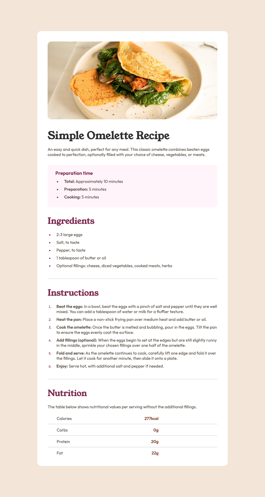

# Recipe page

A responsive recipe page. This page was built as a front-end project of[Frontend Mentor](https://www.frontendmentor.io/challenges/recipe-page-KiTsR8QQKm). 

### Screenshot



### Links

- [Page](https://norwyx.github.io/recipe-page/) - Final result of the project

## My process

### Built with

- [HTML5](https://developer.mozilla.org/es/docs/HTML/HTML5)
- [CSS3](https://developer.mozilla.org/es/docs/Web/CSS/CSS3)
- [Github Pages](https://pages.github.com/)


### What I learned

In all my time coding, I've never customized a bullet point. I learned the following property existed:

```css
ul li {
    list-style-type: square;
}
```

## Author

- Website - [Manuel Salazar](manuelsalazardev.netlify.app)
- Frontend Mentor - [@yourusername](https://www.frontendmentor.io/profile/Norwyx)
- Twitter - [@norwyx](https://www.twitter.com/norwyx)
